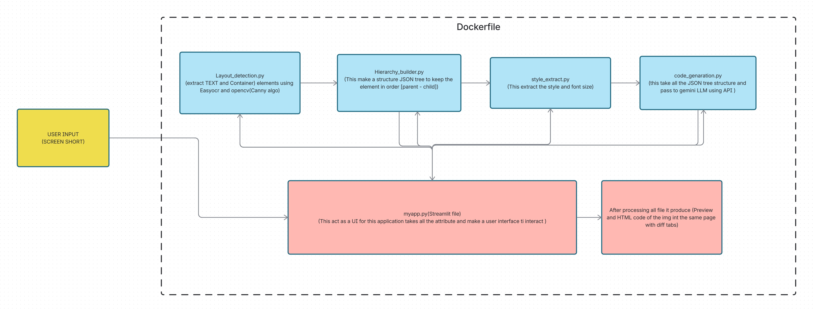

## 🧩 System Architecture

  

# imgcodeAI

Convert UI screenshots into structured, clean HTML/CSS code using a modular compiler-style architecture.

---

## 🚀 Tech Stack

### 🖥 Frontend
- **Streamlit** – User interface for uploading screenshots and viewing generated results

### ⚙ Backend / Core Processing
- **Python** – Core language
- **OpenCV** – Layout detection and contour extraction
- **NumPy** – Matrix operations
- **EasyOCR** – OCR-based text detection

### 🧠 Code Generation
- Template-based HTML builder  
- Optional controlled LLM API (only after structured representation is created)

---

## 🏗 Approach

The system follows a **modular compiler-style architecture** instead of a direct black-box generation method.

### Key Strategies

- Computer Vision for UI element detection
- Rule-based spatial grouping for layout hierarchy construction
- Color clustering for style extraction
- JSON-based intermediate layout representation
- Template-driven or controlled LLM-assisted HTML generation
- Visual and structural evaluation metrics

Each stage is **independent, testable, and extensible**.

---

## 🔄 Workflow Stages

### 1️⃣ Layout Detection
Detect UI elements such as text blocks, buttons, images, and containers using computer vision techniques.  
**Output:** Bounding boxes with element classification.

---

### 2️⃣ Layout Hierarchy Construction
Convert detected flat elements into a structured layout tree capturing:
- Parent-child relationships  
- Row/column groupings  

**Output:** JSON layout tree.

---

### 3️⃣ Style Extraction
Extract:
- Dominant colors  
- Font size approximations  
- Spacing and alignment  

**Output:** Style mapping JSON.

---

### 4️⃣ Code Generation
Convert structured layout and style information into clean HTML/CSS using:
- Template engine  
- Controlled LLM (optional)

**Output:** Generated HTML file.

---

